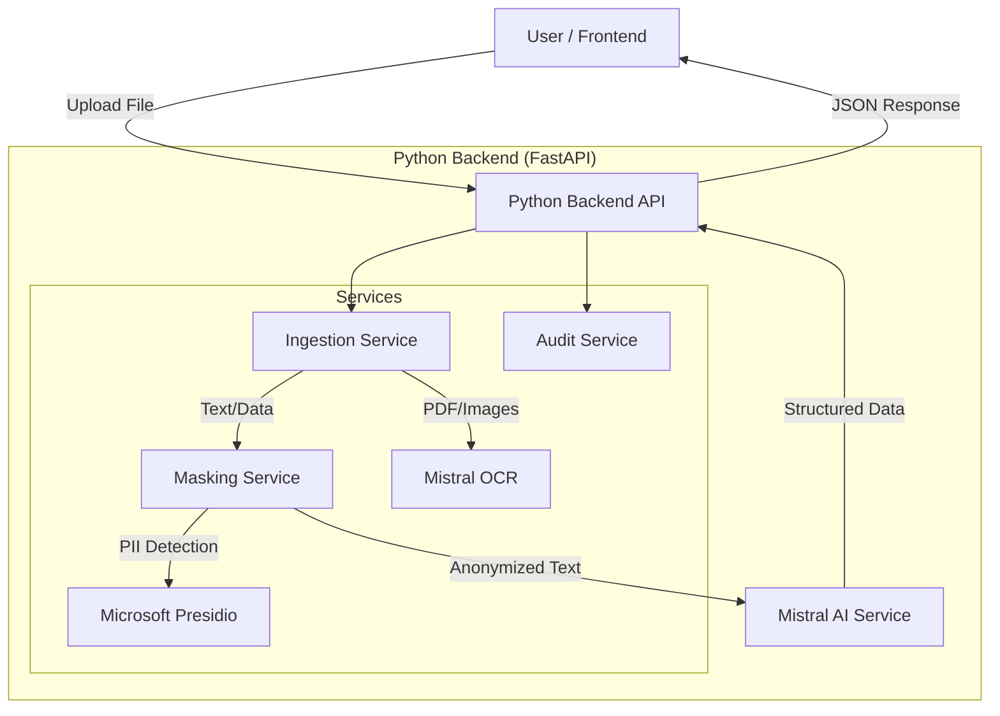

# System Architecture: RFQ Intelligence

## Overview
The system has been migrated from a monolithic Node.js client-side processing model to a **Python Microservice Architecture**. This improves GDPR compliance, extraction accuracy, and performance.

## detailed Component Flow

### 1. Frontend (React + Vite)
- **Role**: User Interface for uploading documents and verifying quotes.
- **Action**: When a user uploads a file, the `extraction.ts` pipeline sends the file to the Python Backend (`https://ocrapi-tp33.onrender.com/process`).
- **State**: No longer performs heavy PDF parsing or OCR locally.

### 2. Python Backend (FastAPI)
Hosted on **Render**, this is the core engine.

#### A. Ingestion Service (`services/ingestion.py`)
- **Determines File Type**:
  - **Native PDF**: Uses `PyMuPDF` to extract text and tables.
  - **Excel**: Uses `Pandas` to read sheets.
  - **Word**: Uses `python-docx`.
  - **Scanned PDF/Image**: Fails over to **Mistral OCR** (via `services/ocr.py`).

#### B. Masking Service (GDPR) (`services/masking.py`)
- **Role**: Protects sensitive data BEFORE it leaves our server.
- **Tool**: **Microsoft Presidio** + Spacy (German Model).
- **Process**:
  1. Identifies PII (Names, Phone Numbers, Emails, Addresses).
  2. Replaces them with tokens (e.g., `<PERSON>`, `<PHONE_NUMBER>`).
  3. **Result**: The AI never sees the actual personal data.

#### C. AI Service (`services/ai.py`)
- **Role**: Extracts structured RFQ data (line items, quantities, materials).
- **Model**: **Mistral Small** (via API).
- **Input**: Anonymized text.
- **Output**: JSON structure matching our RFQ schema.

#### D. Audit Service (`services/audit.py`)
- **Role**: Compliance logging.
- **Action**: Logs *metadata* about every request (e.g., "Processed PDF, masked 5 entities") but **never logs the content** itself.

### 3. Deployment (Render & Docker)
- **Container**: The backend is packaged in a **Docker** container.
- **Optimization**: The `Dockerfile` pre-downloads the Spacy German model so the server starts fast.
- **Keep-Alive**: A background keep-alive mechanism ensures the free-tier server doesn't fall asleep during the demo.

## Data Flow Example

1.  **Upload**: User uploads `inquiry.pdf`.
2.  **Ingest**: Python extracts raw text: *"Hello, I am Hans from ZF..."*
3.  **Mask**: Presidio converts it to: *"Hello, I am <PERSON> from <ORG>..."*
4.  **Extract**: Mistral AI reads the masked text and finds: `Item: Steel Shaft, Qty: 50`.
5.  **Return**: Frontend receives the structured data and displays it in the editor.
